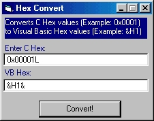



## C Hex to VB Hex Convertor \* Updated and Fixed\*

### Description

* Thanks to Paul Mather I improved my lame skills in strings, now the function is MUCH shorter

I have created a function that converts C Hex values (Example: 0x0001) to VB Hex values (Example: &H1) with no APIs , just one usefull function.

And one things is fixed, in the updated version I put a removing of the all zeros in the hex, now fixed... :-)
 
### More Info
 

             |
---                |---
**Submitted On**   |2000-03-11 22:33:58
**By**             |[Max Raskin](https://github.com/Planet-Source-Code/PSCIndex/blob/master/ByAuthor/max-raskin.md)
**Level**          |Advanced
**User Rating**    |5.0 (10 globes from 2 users)
**Compatibility**  |VB 5\.0, VB 6\.0
**Category**       |[Miscellaneous](https://github.com/Planet-Source-Code/PSCIndex/blob/master/ByCategory/miscellaneous__1-1.md)
**World**          |[Visual Basic](https://github.com/Planet-Source-Code/PSCIndex/blob/master/ByWorld/visual-basic.md)
**Archive File**   |[CODE\_UPLOAD40373172000\.zip](https://github.com/Planet-Source-Code/max-raskin-c-hex-to-vb-hex-convertor-updated-and-fixed__1-6482/archive/master.zip)

